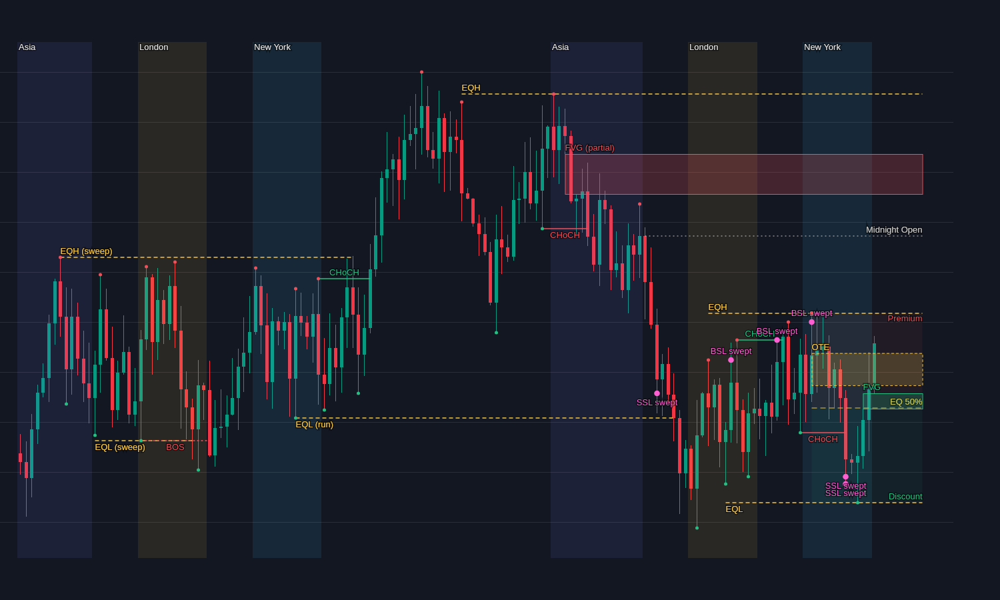

# ICT Chart Annotator (GBPUSD)

Upload up to four TradingView screenshots of GBPUSD (**1D, 1H, 15M, 5M**). The app reads the candles out of each image, converts them to real prices, runs a set of ICT (Inner Circle Trader) detectors on those prices, and draws the results on top of your screenshot. It then combines the four charts into a higher-timeframe bias and a ranked list of confluence zones.

Everything runs in your browser. There is no backend and nothing is uploaded.



*The image above is produced by `npm run demo` from a synthetic chart: sessions, equal highs/lows, sweeps, BOS/CHoCH, FVGs, premium/discount, OTE and key levels.*

---

## Contents

1. [Quick start](#quick-start)
2. [Taking good screenshots](#taking-good-screenshots)
3. [Using the app](#using-the-app)
4. [What gets drawn](#what-gets-drawn)
5. [How it works](#how-it-works)
6. [Exact ICT definitions used](#exact-ict-definitions-used)
7. [Multi-timeframe layer](#multi-timeframe-layer)
8. [Tuning the detectors](#tuning-the-detectors)
9. [Project structure](#project-structure)
10. [Tests and what they prove](#tests-and-what-they-prove)
11. [Limitations](#limitations)
12. [Reusing the engine in your bigger project](#reusing-the-engine-in-your-bigger-project)
13. [Troubleshooting](#troubleshooting)

---

## Quick start

Requires **Node.js 20.19+ or 22+**.

```bash
npm install
npm run dev        # open the printed http://localhost:5173 address
```

| Command | What it does |
|---|---|
| `npm run dev` | Start the app with hot reload |
| `npm run build` | Typecheck, then produce a static build in `dist/` |
| `npm run preview` | Serve the production build locally |
| `npm test` | Run all 51 tests |
| `npm run typecheck` | TypeScript check only |
| `npm run demo` | Render a synthetic chart, analyse the *image*, write `demo-output/annotated.png` |

The first time you press **Read price axis (OCR)** the browser downloads the OCR engine and English language data, so it needs an internet connection once. After that it is cached by the browser.

---

## Taking good screenshots

The app reads pixels, so the cleaner the screenshot, the more exact the result. In TradingView:

- **Use the default candle colours** (green/red, solid candles). Custom colours work too: pick them under *Candle detection*. Hollow candles and Heikin Ashi are not supported.
- **Turn off the last-price line** (Settings → Symbol → switch off the price line option). A line the same colour as the candles touches the last candle and confuses the detector.
- **Hide indicators, drawings, volume and the crosshair.** Anything green or red on the chart can be mistaken for candles.
- **Keep the price axis visible on the right** (needed to read prices) and leave the **time axis** visible.
- **Show roughly 80–200 candles.** Candle bodies must be at least **3 pixels wide**. If candles are too thin, zoom in, or take the screenshot on a high-DPI screen.
- **Linear price scale only** (not logarithmic).
- Use the camera icon → *Save image*, or a normal screenshot cropped to the chart. Include the whole chart pane and the price axis.
- Note down the **date/time of the right-most candle** and the **chart's timezone** (TradingView shows it at the bottom right). You type these in.

---

## Using the app

Work through the four tabs (1D, 1H, 15M, 5M). You do not need all four. Each tab has the same three steps.

**1. Last candle.** Enter the date and time of the right-most candle and the chart's UTC offset (for example `5.5` for India, `0` for UTC). The app only needs *one* timestamp, because every earlier candle is counted backwards from it. The weekend gap (Friday 17:00 to Sunday 17:00 New York time) is skipped automatically. For the daily chart you only enter a date.

**2. Price axis.** Press **Read price axis (OCR)**. The app reads the price labels on the right, throws away misread ones, and fits a line through the rest. The status line tells you how many labels agreed and the error in pixels. If OCR fails, choose **Or click 2 points on the chart**: click two places on the screenshot (each draws a pink line), then type the price at each line. Manual calibration takes priority over OCR.

**3. Candle detection.** Usually leave this alone. *Colours* has an automatic mode for green/red and a custom mode. *Search region* is the pixel rectangle searched for candles. By default it skips the top 7% (where TradingView draws the OHLC legend, which is coloured text) and the bottom 7% (time axis). Adjust it if the legend overlaps your candles or the price is close to the top.

Press **Analyze chart**. Then:

- Tick **Extracted candles (debug)** in the side panel. Yellow boxes appear around every candle the app found. **Always check this once per screenshot.** If the boxes line up with the candles, the analysis is trustworthy.
- Toggle layers on and off in the side panel.
- **Download annotated PNG** saves what you see. **Download candles CSV** saves the reconstructed OHLC data (UTC timestamps), which is a ready-made dataset for your bigger project.
- As you analyse more tabs, the side panel updates the higher-timeframe bias and the confluence list, and higher-timeframe zones appear as dashed bands on the lower-timeframe charts.

---

## What gets drawn

| Layer | Drawn as |
|---|---|
| Structure | Line from the broken swing to the breaking candle, labelled **BOS** (dashed) or **CHoCH** (solid) |
| Swing points | Small dots on swing highs (red) and lows (green) |
| Fair value gaps | Green (bullish) or red (bearish) boxes extending right until filled. "partial" means price has entered but not closed it |
| Order blocks / breakers | Blue (bullish) or orange (bearish) boxes; purple when the block failed and became a **Breaker** |
| Equal highs / lows | Dashed yellow line labelled **EQH / EQL**, with `(sweep)` or `(run)` once taken |
| Liquidity sweeps | Pink dot and label **BSL swept** (above a high) or **SSL swept** (below a low) |
| Premium / discount / OTE | Red tint above and green tint below the 50% line, plus the 62–79% OTE box |
| Sessions | Shaded columns for Asia, London and New York kill zones |
| Judas swing | Label at the London-open sweep of the Asia range |
| Key levels | Dotted lines for **PDH**, **PDL** and **Midnight Open** |
| Higher-timeframe zones | White dashed bands labelled like `1H FVG ▲` or `1D OB ▼` |
| Extracted candles (debug) | Yellow outline around every detected candle |

*Show filled / mitigated zones* additionally draws zones that price has already used, dimmed.

---

## How it works

```
screenshot ──► candle pixels ──► prices ──► timestamps ──► ICT detectors ──► overlay
   (image)       vision/          vision/     core/           ict/            render/
```

### 1. Finding candles in the image (`src/vision/`)

The key idea: a TradingView candle is a flat-coloured rectangle (the body) with a 1px line (the wick) through it, so no machine learning is required. Classical pixel processing is exact and deterministic.

1. **Colour every pixel** as up-candle, down-candle or neither (`colors.ts`). The default classifier accepts any saturated teal/green or red, which covers both TradingView palettes in dark and light themes.
2. **Group touching pixels into blobs** with an 8-connected flood fill (`components.ts`). A candle's body and wick touch, so one candle is one blob.
3. **Keep only real candles** (`extractCandles.ts`). Real candles share the same body width and are evenly spaced. The app measures the modal body width and the candle spacing, then takes the longest chain of blobs that fits that rhythm. Legend text, the price tag on the axis and stray shapes do not fit and are dropped, and the app tells you how many it ignored.
4. **Read the geometry.** The blob's top and bottom give high and low. Its widest rows are the body, giving open and close. Green means close is the top of the body; red means close is the bottom.

### 2. Pixels to prices (`priceAxis.ts`, `ocr.ts`)

The price axis is a straight line: `price = slope × pixelRow + intercept`.

- **OCR** (Tesseract.js, loaded on demand) reads the axis labels from the right edge. Only strings shaped like `1.34250` are kept.
- **RANSAC fit**: every pair of labels proposes a line, and the line supported by the most labels wins. A misread label can never bend the result. The winning labels are then refined with least squares.
- **Manual fallback**: two clicked points and two typed prices define the same line.
- A plausibility check warns if any price falls outside GBPUSD's historical range (0.80–2.60), which usually means a wrong calibration.

### 3. Timestamps (`core/market.ts`)

You give the time of the last candle; the rest are counted backwards by the timeframe, skipping the weekend closure. Times are stored as UTC. Session logic converts to **New York time using `Intl`**, so US daylight saving is handled automatically. (The UTC offset of your *chart* is something you enter, so update it if your own timezone changes.)

### 4. ICT detectors (`src/ict/`)

Each detector is a pure function from candles to annotations, so the same candles always give the same result and each can be tested alone. `engine.ts` runs them all. To keep charts readable it keeps the most recent 12 active zones per kind (plus half as many already-resolved ones).

### 5. Drawing (`src/render/`)

`overlay.ts` maps candle index to x and price to y using the exact geometry read from the screenshot, then paints each enabled layer in a fixed order (background shading first, text last).

---

## Exact ICT definitions used

ICT concepts are partly discretionary. These are the precise, testable rules this app uses. Everything is computed from candle **closes or wicks as stated**, and never uses future candles (a swing is only "confirmed" after its lookback bars have printed).

| Concept | Rule |
|---|---|
| **Swing high / low** | Higher (lower) than the `swingLookback` candles before it and at least as high (low) as the ones after. Of two equal highs, the first is the swing. Default lookback 3 (2 on daily). |
| **BOS** | A candle **close** beyond the latest unbroken swing, in the direction of the current trend (the very first break also counts as BOS). |
| **CHoCH** | The first close beyond a swing *against* the current trend. |
| **Displacement** | Candle body ≥ 1.2 × ATR(14) and the close is in the outer 30% of its range. |
| **FVG** | Bullish: `candle3.low > candle1.high`, zone = that gap. Bearish: `candle3.high < candle1.low`. Gaps under 0.5 pip (15M/5M) or 2 pips (1H/1D) are ignored. **Partial** once price enters the gap; **filled** once price reaches the far edge. `impulsive` if candle 2 was a displacement candle. |
| **Order block** | For a bullish break: find the lowest low between the broken swing and the break candle, then take the last **bearish** candle at or before it (within 10 candles). It only counts if a bullish **displacement** candle follows it before the break. Zone = candle body (configurable to full range). Bearish is the mirror image. |
| **Mitigated / Breaker** | Mitigated when price trades back into the block. It becomes a **breaker** when a candle closes through its far side. |
| **Equal highs / lows** | Two or more swing highs (lows) within 2 pips (5 pips on 1H/1D) with no candle pushing beyond them in between. Buy-side liquidity rests above equal highs, sell-side below equal lows. |
| **Sweep vs run** | The first candle whose wick takes the level: it is a **sweep** if it closes back inside, a **run** if it closes beyond. |
| **Liquidity sweep marker** | Same rule applied to single swing points. |
| **Dealing range** | Latest confirmed swing high to latest confirmed swing low. **Equilibrium** is 50%. Above is premium, below is discount. |
| **OTE** | 62%–79% retracement of the dealing range, measured from the extreme in the trend direction (in discount for a bullish trend, premium for bearish). |
| **Sessions** (New York time) | Asia 20:00–00:00, London kill zone 02:00–05:00, New York kill zone 07:00–10:00. The Asia range belongs to the following day. Not drawn on the daily chart. |
| **Judas swing** | Inside the London kill zone a candle takes the Asia high (low) but not the other side, and the kill zone ends back below (above) it. |
| **PDH / PDL** | High and low of the previous trading day (17:00 New York to 17:00 New York). Only drawn when at least 90% of that day's candles are visible. On the daily chart, simply the previous candle. |
| **Midnight Open** | Open of the 00:00 New York candle of the latest day. |

---

## Multi-timeframe layer

Screenshots of different timeframes share only one thing: the price axis. So higher-timeframe information is transferred as **horizontal price bands**.

- **Bias** (`mtf/bias.ts`): from the market-structure trend of the 1D and 1H charts. Both agree = *strong*; only one chart = *partial*; they disagree = *conflict* (direction neutral). It also reports whether the latest close is in premium, discount or equilibrium of the 1H range (1D if there is no 1H chart).
- **Projection** (`mtf/zones.ts`): open FVGs, unmitigated order blocks, unswept equal highs/lows, PDH/PDL, equilibrium and OTE from the 1D and 1H charts are drawn on every lower-timeframe chart.
- **Confluence** (`mtf/confluence.ts`): every open FVG and unmitigated order block on the 1H, 15M and 5M charts is scored:

| Points | Condition |
|---|---|
| +2 | Zone direction matches the 1D/1H bias |
| +2 | Zone overlaps a same-direction FVG or order block from a higher timeframe |
| +1 | Bullish zone in discount / bearish zone in premium of the higher-timeframe range |
| +1 | Zone overlaps the higher-timeframe OTE band |
| +1 | Opposite-side liquidity was swept within 15 candles before the zone formed |
| +1 | FVG made by a displacement candle, or an order block that caused a structure break |

The top 10 are listed with their reasons. **This ranks areas of interest. It is not a trade signal or financial advice.**

---

## Tuning the detectors

All numbers live in one file: [`src/ict/params.ts`](src/ict/params.ts). `defaultParams(timeframe)` returns them per timeframe, and `runIct(candles, timeframe, params)` accepts your own set.

| Parameter | Default | Meaning |
|---|---|---|
| `swingLookback` | 3 (2 on 1D) | Bars each side for a swing point. Higher = fewer, more significant swings |
| `atrPeriod` | 14 | ATR length used by displacement |
| `displacementAtrMultiple` | 1.2 | Minimum candle body in ATRs |
| `displacementCloseRatio` | 0.7 | How close to its extreme a displacement candle must close |
| `equalLevelTolerancePips` | 2 (5 on 1H/1D) | "Equal" high/low tolerance |
| `minFvgPips` | 0.5 (2 on 1H/1D) | Smallest FVG shown |
| `orderBlockUsesBody` | `true` | Zone = body; `false` = full candle range |
| `orderBlockLookback` | 10 | Candles searched back from the swing for the block candle |
| `oteFrom` / `oteTo` | 0.62 / 0.79 | OTE band |
| `maxZonesPerKind` | 12 | Clutter cap |

Order blocks are deliberately rare: they need a structure break *and* a displacement candle. If you see none, that is expected on quiet charts.

---

## Project structure

```
src/
  types.ts                 Candle, Timeframe, Direction
  core/
    market.ts              Pip size, New York clock, forex weekly schedule, timestamps
    math.ts                ATR, median, mode, least squares
  vision/                  Screenshot -> prices
    raster.ts              RasterImage / Rect types and default search regions
    colors.ts              Pixel classifiers (automatic and custom colours)
    components.ts          Connected-component labelling
    extractCandles.ts      Finds candles: blob filtering, spacing, geometry
    priceAxis.ts           RANSAC axis fit, manual calibration, pixels -> OHLC
    ocr.ts                 Reads axis labels with Tesseract.js (browser only)
    loadImage.ts           File -> pixel buffer (browser only)
  ict/                     Pure detectors, one concept per file
    swings.ts  structure.ts  displacement.ts  fvg.ts  orderBlocks.ts
    liquidity.ts  range.ts  sessions.ts  levels.ts
    params.ts              Every tunable number
    engine.ts              runIct(): runs everything on one chart
    annotations.ts         Result types
  mtf/                     Multi-timeframe: bias.ts, zones.ts, confluence.ts
  pipeline/                analyzeScreenshot(): image -> candles -> annotations
  render/                  Canvas drawing: overlay.ts, layers.ts, theme.ts, primitives.ts
  export/candles.ts        CSV / JSON export and download
  ui/                      React UI: ChartPanel, SummaryPanel, calibration helper
  App.tsx  main.tsx  styles.css
tests/                     Vitest suites and a synthetic-chart generator (tests/helpers)
scripts/demo.ts            `npm run demo`
```

Design rules followed throughout: the `vision`, `ict`, `mtf` and `pipeline` folders contain no browser code, so they run identically in Node (tests, scripts) and in the browser. UI, OCR and image loading are the only parts that touch the DOM.

---

## Tests and what they prove

`npm test` runs **51 tests** in five files:

- **Candle extraction** on synthetic TradingView-style charts rendered from known price data. Ground truth is known, so accuracy is measured: every one of 150 candles is recovered, high/low are within half a pixel (pure rounding), open/close within 1.5 pixels, on dark and light themes, both TradingView palettes, custom colours, a 2× retina layout with 2px wicks, with a price tag on the axis, and with legend-like text in the search area. It also checks that too-thin candles and blank images produce a clear warning instead of a guess.
- **Price axis**: RANSAC recovers the exact axis even when labels are jittered and some are misread.
- **Market clock**: daylight saving, the 17:00 trading-day rollover, weekend closure, timestamp back-counting.
- **Every ICT detector** on small hand-built candle sequences with known answers (FVG partial/filled, order block mitigated/breaker, sweep vs run, Judas swing, PDH/PDL, OTE, and more).
- **End to end**: image → candles → annotations, compared with running the engine on the original data: over 80% of FVGs and 85% of swing points match (differences come only from sub-pixel rounding at near-equal prices). Also the multi-timeframe scoring.

**What was not verified in the build environment:** the browser-only pieces (OCR with Tesseract.js, file upload, the React UI) and real TradingView screenshots. The pixel geometry is tested on synthetic charts that mimic TradingView's crisp rendering, but real screenshots can differ (anti-aliasing, fonts, overlays). That is why the **Extracted candles (debug)** layer and the manual calibration fallback exist. Check them on your first real screenshot.

---

## Limitations

- **Precision is limited by pixels.** One pixel is typically 0.1–0.3 pip on a full-height chart. Levels are accurate to about a pixel, not to the pip.
- Linear price axis only. No log scale, hollow candles or Heikin Ashi.
- Candle bodies must be at least 3 px wide, and candles must form one unbroken row. A missing or merged candle splits the row and the app keeps the longest part (it warns you).
- Only one timestamp is entered, so if the chart has gaps (missing data) later candles are mis-timed. Times only matter for sessions, Judas swings and PDH/PDL.
- Session windows use fixed New York hours. TradingView data feeds differ slightly on the exact weekly open.
- ICT rules are interpretations. Another trader's order block or swing can legitimately differ. Change `params.ts` to match your style.
- The detectors describe what already happened. Nothing here predicts price.

---

## Reusing the engine in your bigger project

The ICT engine does not depend on images. Anything that produces a list of candles can use it:

```ts
import { runIct } from './src/ict/engine';
import { assignTimes } from './src/core/market';

const candles = assignTimes(myOhlcBars, '15m', lastCandleUnixSeconds);
const analysis = runIct(candles, '15m');
// analysis.fvgs, .orderBlocks, .structure, .pools, .sweeps, .range, .sessions, .levels ...
```

For your forex prediction model that means you can:

- Turn the annotations into **features** (distance to the nearest open FVG, whether liquidity was just swept, position inside the dealing range, session, HTF bias) and train on years of real OHLC data.
- Use **Download candles CSV** to capture on-screen data, though real historical GBPUSD data from a provider will be far larger and cleaner than screenshots.
- Replace or extend any detector by editing one file in `src/ict/`. The tests show the expected shape.

---

## Troubleshooting

| Symptom | Fix |
|---|---|
| "Found N candles, need at least 15" | Wrong colours, region too small, or candles too thin. Use the debug layer, adjust the search region, or zoom the TradingView chart in |
| "coloured shape(s) were ignored" | Normal if you left the legend or price tag in. Fine as long as the yellow debug boxes cover every real candle |
| Candles missing near the right edge | Turn off TradingView's last-price line and check the search region's *right* value |
| OCR finds fewer than 2 labels | Use *Or click 2 points on the chart* and type two prices from the axis |
| "price labels do not line up" | OCR misread too many labels. Use manual calibration |
| Warning: prices outside GBPUSD range | Calibration is wrong. Redo step 2 |
| Zones look shifted vertically | Calibration error. Use two well-separated axis labels (top and bottom of the chart) for manual calibration |
| Sessions look an hour off | Check the UTC offset. It must be the offset of the *chart's* timezone at that date (daylight saving changes it) |
| OCR never starts | The first run downloads OCR data and needs internet |
# gbpusd-ict
